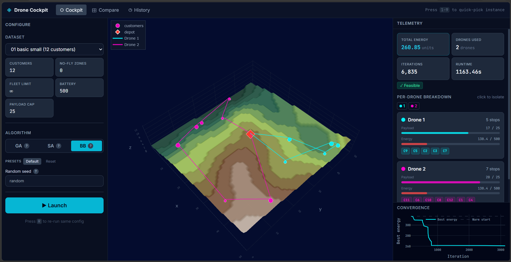
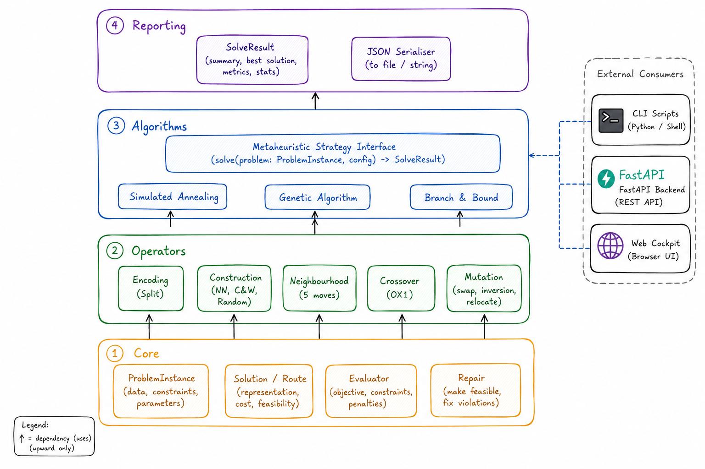

# Drone-Based Delivery Optimization

An end-to-end research toolkit for energy-aware, last-mile drone routing in
three-dimensional environments. The project generates reproducible benchmark
instances with terrain and no-fly zones, solves them with exact and
metaheuristic algorithms, and provides a web cockpit for configuring runs and
inspecting routes.



## Features

- Configuration-driven generation of 3D benchmark instances.
- Obstacle-aware, asymmetric travel costs computed from terrain, altitude, and
  no-fly zones.
- Branch and Bound exact solver with a linear-programming relaxation.
- Genetic Algorithm and Simulated Annealing solvers with problem-specific
  construction, crossover, mutation, neighborhood, and repair operators.
- Command-line tools for generation, solving, benchmarking, and visualization.
- FastAPI backend with server-sent progress events.
- React and TypeScript cockpit with route visualization, run comparison, and
  run history.
- Automated tests for the generator, solvers, and API.

## Problem model

Each instance contains a central depot, customers with payload demand, a drone
profile, terrain, optional no-fly zones, and a precomputed travel-cost matrix.
Every customer must be served exactly once. Each route starts and ends at the
depot and must respect payload, battery, and optional fleet-size limits. The
objective is to minimize total energy consumption.

The same obstacle-aware cost matrix is consumed by every solver, which keeps
comparisons between the exact method, Genetic Algorithm, and Simulated
Annealing consistent.

## Repository structure

```text
app/                    FastAPI application, schemas, services, and API tests
configs/                Generator configuration for the benchmark scenarios
data/instances/         Ten reproducible benchmark instances
data_generator/         Terrain, placement, pathfinding, and validation code
docs/                   Mathematical, algorithm, and presentation sources
metaheuristics/         Exact and metaheuristic solver implementations
scripts/                Generation, solving, benchmarking, and visualization CLIs
tests/                  Generator and solver test suite
web/                    React, TypeScript, Tailwind, and Vite frontend
```

Generated solver output is written to `data/solver_runs/` and is intentionally
excluded from version control.



## Requirements

- Python 3.10 or newer
- Node.js 20.19 or newer and npm, for the web interface
- A C compiler is not required for the standard installation

## Installation

Clone the repository and create an isolated Python environment:

```bash
git clone https://github.com/akrambel2115/Drone-Based-Delivery-Optimization.git
cd Drone-Based-Delivery-Optimization
python -m venv .venv
```

Activate the environment on Linux or macOS:

```bash
source .venv/bin/activate
```

Activate it on Windows PowerShell:

```powershell
.venv\Scripts\Activate.ps1
```

Install the core solver and test dependencies:

```bash
python -m pip install --upgrade pip
python -m pip install -r requirements.txt
```

The repository does not require credentials or environment variables for local
use. If deployment-specific configuration is added later, keep real values in
an untracked `.env` file and commit only a sanitized `.env.example`.

## Command-line usage

Generate all configured benchmark instances:

```bash
python scripts/generate_all.py
```

Solve the smallest instance with Simulated Annealing:

```bash
python scripts/solve_metaheuristic.py sa data/instances/instance_01_basic_small.json
```

Run the Genetic Algorithm with a fixed random seed and save the result:

```bash
python scripts/solve_metaheuristic.py ga data/instances/instance_05_dense_medium.json --seed 42 --out data/solver_runs/ga_instance_05.json
```

Run the complete benchmark sweep:

```bash
python scripts/benchmark_metaheuristics.py
```

Create an interactive visualization for an instance:

```bash
python scripts/visualize_instance.py data/instances/instance_04_dense_small.json
```

Use `--help` with any script to see its complete option reference.

## Web application

Install the API dependencies and start the backend from the repository root:

```bash
python -m pip install -r requirements-app.txt
python -m uvicorn app.main:app --reload --host 127.0.0.1 --port 8000
```

The OpenAPI interface is available at <http://127.0.0.1:8000/docs>.

In a second terminal, install and start the frontend:

```bash
cd web
npm ci
npm run dev
```

Open <http://127.0.0.1:5173>. The Vite development server proxies API requests
to the backend.

## Testing and validation

Run all Python tests from the repository root:

```bash
python -m pytest
```

Build the frontend:

```bash
cd web
npm ci
npm run build
```

The benchmark JSON files are generated deterministically from the configuration
files. To validate reproducibility after changing generator code, regenerate the
instances and inspect the resulting Git diff.

## Documentation

- [Metaheuristic design](docs/metaheuristics.md) describes the domain model,
  encodings, operators, algorithms, configuration, and test strategy.
- [Mathematical formulation](docs/Formulation.tex) contains the optimization
  models and constraints.
- [Complexity proof](docs/Proof.tex) documents the computational-complexity
  analysis.
- [Branch and Bound](docs/BranchAndBound.tex) explains the exact solution
  method.
- [Presentation source](docs/Presentation.tex) provides the Beamer presentation
  for the project.

## Security and responsible use

No credentials are required by the application. Do not commit API keys,
passwords, private keys, personal datasets, or local environment files. The
repository ignore rules cover common secret-bearing and machine-specific files,
but they do not replace a secret scan before publishing or accepting changes.

If a secret is committed, revoke or rotate it first, then remove it from the
entire Git history before making the repository public. Deleting it only from
the latest commit is not sufficient.

## Contributing

Keep changes focused, add or update tests when behavior changes, and use
conventional commit messages such as `feat:`, `fix:`, `docs:`, `test:`, and
`chore:`. Before opening a pull request, run the Python test suite and frontend
build.

## License

No open-source license has been selected. Add a license before publication if
you want others to have explicit permission to use, modify, or redistribute the
project.
